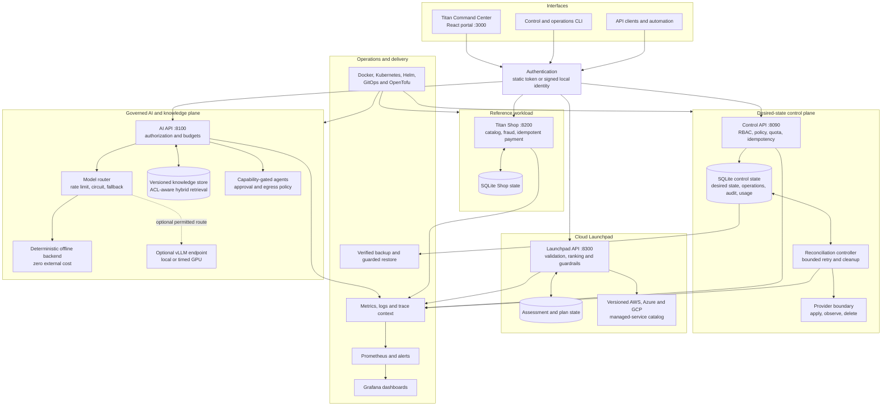
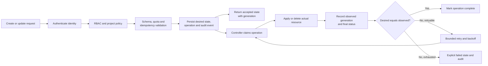
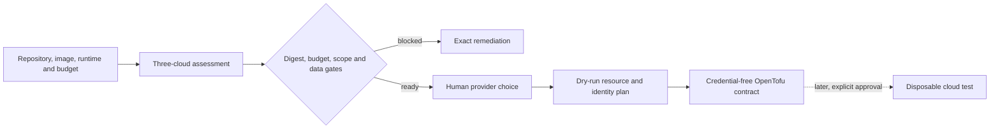
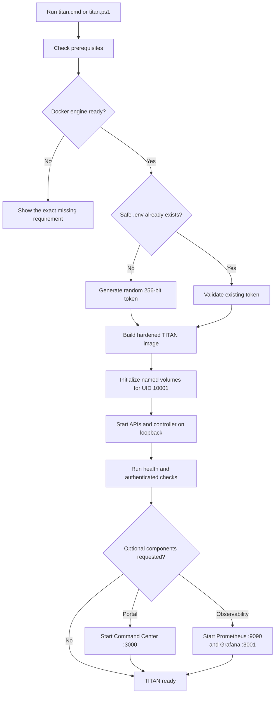
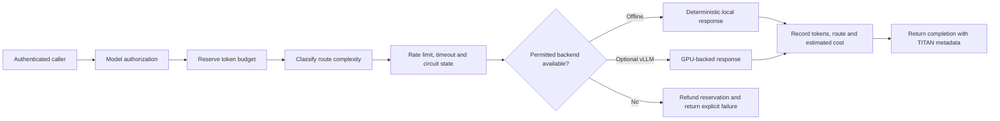
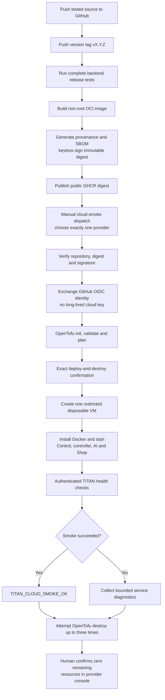

# Project TITAN

> A zero-cost-first, AI-native cloud control plane and 37-phase platform-engineering laboratory that runs on one laptop and scales conceptually into Kubernetes, GitOps, SRE, secure AI, GPU inference and disposable multi-cloud infrastructure.

[](pyproject.toml)
[](portal/package.json)
[](Containerfile)
[](infrastructure/opentofu/README.md)
[](VERSION)

Project TITAN is a finished reference implementation and learning environment for
understanding how modern internal platforms are designed. It combines a desired-state
control plane, reconciliation controller, governed AI gateway, knowledge plane,
agent safety model, multi-cloud Launchpad, developer portal, reference commerce workload, observability,
recovery, Kubernetes packaging and guarded cloud laboratories in one repository.

The default path is deliberately small: it runs offline on a Windows/WSL or Linux
laptop without an external model API, GPU, managed database or monthly cloud service.
Optional components are enabled only when the learner is ready to study them.

<details>
<summary><strong>Table of contents</strong></summary>

- [Project status](#project-status)
- [Why TITAN exists](#why-titan-exists)
- [System architecture](#system-architecture)
- [Implemented capabilities](#implemented-capabilities)
- [Cloud Launchpad](#cloud-launchpad)
- [Fastest local start on Windows](#fastest-local-start-on-windows)
- [Manual local start](#manual-local-start)
- [AI request flow](#ai-request-flow)
- [Deployment options](#deployment-options)
- [Signed multi-cloud smoke flow](#signed-multi-cloud-smoke-flow)
- [CI, security and release automation](#ci-security-and-release-automation)
- [Verification](#verification)
- [Repository map](#repository-map)
- [Security invariants](#security-invariants)
- [37-phase learning path](#37-phase-learning-path)
- [Hardware and cost profile](#hardware-and-cost-profile)
- [Honest limitations and production path](#honest-limitations-and-production-path)
- [Documentation](#documentation)

</details>

## Project status

| Area | Status | What that means |
|---|---|---|
| Core Python services | Implemented and tested | Control, controller, AI, knowledge, agents, Shop, operations and capacity logic run locally |
| Command Center portal | Implemented and tested | React portal provides demo and live-API modes |
| Cloud Launchpad | Prototype-ready and tested | Source-linked AWS/Azure/GCP assessment, persisted dry-run plans and credential-free IaC contracts |
| Local Docker platform | Ready | One launcher generates secrets, builds, starts and health-checks the stack |
| CI and security automation | Ready | Tests, container checks, manifest rendering, secret scanning, image scanning and SBOM generation |
| Kubernetes and GitOps | Reference-ready | Kustomize, Helm, Argo CD, operator, policy and progressive-delivery manifests are included |
| AWS, Azure and GCP | Code-ready | Guarded OpenTofu modules and deploy/check/destroy automation validate successfully |
| Live cloud verification | Pending account connection | Each provider must still be tested with the owner's real free-tier eligibility and OIDC trust |
| 24/7 enterprise production | Not claimed | HA identity, database, multi-region operations and production assurance require real infrastructure and budget |

## Why TITAN exists

Most tutorials demonstrate a tool in isolation. TITAN demonstrates the boundaries
between tools:

- an API accepts desired state but does not pretend provisioning is synchronous;
- a controller owns reconciliation while GitOps owns declared Kubernetes manifests;
- AI output is treated as untrusted data, never as authorization;
- retries, budgets, approvals, quotas and idempotency are explicit;
- local, Kubernetes and cloud shapes preserve the same trust boundaries;
- failure, cleanup, audit and recovery are part of the design rather than afterthoughts.

It is suitable for learning DevOps, platform engineering, cloud foundations,
Kubernetes, DevSecOps, SRE, AI infrastructure and safe agent architecture from one
coherent system.

## System architecture



### Desired-state request and reconciliation flow



Mutating APIs use idempotency keys, updates use generation preconditions and deletion
waits for provider cleanup. A `202 Accepted` response means desired state was stored;
it does not falsely claim that asynchronous work is already complete.

## Implemented capabilities

### Platform control plane

- project and resource lifecycle APIs;
- resource kinds for services, databases, models, knowledge bases, agents and jobs;
- desired versus observed state and restart-safe operations;
- reconciliation, finalization, drift recovery and bounded retry;
- project membership, roles, quotas, usage metering and append-only audit events;
- idempotent creates and optimistic generation checks for updates;
- local CLI and OpenAPI 3.1 contract.

### AI, RAG and agent governance

- OpenAI-shaped chat-completion endpoint;
- deterministic offline model for free, reproducible tests;
- optional vLLM route with cost metadata, timeout, circuit breaker and permitted fallback;
- per-project token budgets and request-rate limits;
- versioned ingestion, deterministic chunking and ACL-aware hybrid search;
- stable citations and deletion-aware knowledge retrieval;
- 120-case evaluation suite with quality, cost and critical-regression gates;
- capability-based agent tools, exact approvals, kill switch and restricted egress;
- prompt-injection and retrieved-content trust labels;
- read-only SRE investigation and guarded remediation with verification and rollback.

### Workload and operations

- Titan Shop catalog, orders, fraud policy and idempotent payment simulator;
- server-side pricing and project/customer authorization;
- Prometheus-format metrics and W3C trace-context handling;
- online SQLite backup, checksum/integrity verification and guarded atomic restore;
- chaos runner with baseline checks, cleanup and recovery verification;
- capacity planning for quotas, accelerators and tenant isolation;
- edge load-balancing and microVM planning experiments.

### Delivery platform

- hardened non-root OCI image;
- Docker Compose core and optional observability/data profiles;
- Kubernetes base plus local and production overlays;
- Helm chart, Argo CD application and progressive rollout examples;
- namespaced Kubernetes operator and custom resource definition;
- Restricted Pod Security, RBAC, network policy and Kyverno examples;
- AWS, Azure and GCP disposable VM modules using one signed image;
- Ansible host configuration and systemd units;
- vLLM, KServe, Kueue, GPU and chaos preview laboratories.

## Cloud Launchpad

Launchpad is the developer-facing bridge between an application description and the
managed services that can run it. Its first golden path supports one containerized
HTTP application with optional PostgreSQL and object storage. It validates the input,
ranks AWS App Runner, Azure Container Apps and Google Cloud Run, links every suggested
service to official documentation and pricing, then stores a guarded provider plan.



The current prototype never receives cloud credentials, never runs `apply`, never
guarantees a free tier and never invents a dollar price. It reports cost drivers and
the official provider calculator instead. Read the complete
[Cloud Launchpad architecture](docs/architecture/cloud-launchpad.md).

## Fastest local start on Windows

The launcher is the recommended path for this repository.

```powershell
.\titan.ps1 doctor
.\titan.ps1 local-up -Portal
```

You can also double-click `titan.cmd` for an interactive menu. The launcher:

1. checks Docker, Node, pnpm, GitHub CLI and WSL;
2. creates an ignored `.env` with a random 256-bit administrator token;
3. builds the image and safely initializes volume ownership for UID `10001`;
4. starts the control plane, controller, offline AI API, Titan Shop and Launchpad;
5. performs liveness and authenticated API checks;
6. optionally starts the portal, Prometheus and Grafana;
7. stops services without deleting state volumes.



### Launcher commands

| Command | Result |
|---|---|
| `.\titan.ps1 doctor` | Reports installed and missing prerequisites without changing the machine |
| `.\titan.ps1 init` | Creates ignored `.titan/settings.json` for public GitHub/OIDC identifiers |
| `.\titan.ps1 local-up` | Builds and starts the core local platform |
| `.\titan.ps1 local-up -Portal` | Starts the core platform and Command Center |
| `.\titan.ps1 local-up -Portal -Observability` | Adds portal, Prometheus and Grafana |
| `.\titan.ps1 local-status` | Shows containers and probes every local endpoint |
| `.\titan.ps1 local-down` | Stops the stack while preserving volumes |
| `.\titan.ps1 github-configure ...` | Writes identifier-only environment variables after exact confirmation |
| `.\titan.ps1 cloud-smoke ...` | Triggers one signed-image deploy/check/destroy workflow after exact confirmation |

Read the [complete launcher guide](docs/learning/launcher.md) before the first cloud
run.

## Manual local start

### Requirements

| Mode | Requirements |
|---|---|
| Core APIs | Docker Engine or Docker Desktop with Compose v2 |
| Portal | Node.js `>=22.13`, pnpm `11.19` |
| Direct Python development | Python `>=3.11`; runtime has no third-party Python dependencies |
| Kubernetes labs | `kubectl`, Kustomize and optionally Helm |
| Cloud labs | OpenTofu `1.8.8`, one provider account and short-lived/OIDC authentication |
| GPU preview | Linux NVIDIA host with a deliberately timed GPU budget |

Copy `.env.example` to the ignored `.env`, replace the administrator token and run:

```bash
docker compose up --build --detach
```

For observability:

```bash
docker compose --profile observability up --build --detach
```

For the portal:

```bash
cd portal
pnpm install --frozen-lockfile
pnpm run dev
```

### Local endpoints

All published ports bind to `127.0.0.1`.

| Component | URL | Authentication |
|---|---|---|
| Reference API | `http://127.0.0.1:8080` | none; introductory API only |
| Control API | `http://127.0.0.1:8090` | bearer token |
| AI API | `http://127.0.0.1:8100` | bearer token |
| Titan Shop | `http://127.0.0.1:8200` | public catalog; protected orders |
| Cloud Launchpad | `http://127.0.0.1:8300` | public catalog/example; protected assessments and plans |
| Command Center | `http://127.0.0.1:3000` | demo mode or in-memory live token |
| Prometheus | `http://127.0.0.1:9090` | local observability profile |
| Grafana | `http://127.0.0.1:3001` | local viewer profile |

### First control-plane request

```bash
export TITAN_TOKEN='copy-the-token-from-your-private-.env'

curl --fail --silent --show-error \
  --request POST http://127.0.0.1:8090/v1/projects \
  --header "Authorization: Bearer $TITAN_TOKEN" \
  --header 'Content-Type: application/json' \
  --header 'Idempotency-Key: first-project' \
  --data '{"name":"learning-lab"}'
```

Repeat the same request with the same key: TITAN returns the same project instead of
creating a duplicate. That small behavior is the entry point into the control-plane
design.

## AI request flow



Knowledge ACL filtering happens before results are returned. Retrieved instructions
remain untrusted. Tool capability, approval, egress and remediation decisions stay
outside the language model.

## Deployment options

| Path | Intended use | State and scale boundary |
|---|---|---|
| `compose.yaml` | Default laptop platform | One control API/controller data store |
| `compose.data.yaml` | PostgreSQL, Redis, Redpanda or MinIO study | Start only the profile being studied |
| `platform/kubernetes` | Local Kubernetes and hardened overlay | SQLite control plane remains one replica |
| `platform/helm/titan` | Packaged Kubernetes installation | Same single-writer boundary |
| `platform/gitops/argocd` | Declarative synchronization | GitOps owns manifests, not TITAN resource state |
| `platform/operator` | CRD/controller laboratory | Namespaced RBAC and finalizer behavior |
| `platform/progressive` | SLO-gated canary study | Requires the referenced rollout controllers |
| `infrastructure/ansible` | Idempotent Linux host setup | One explicitly managed learning host |
| `infrastructure/opentofu` | Disposable AWS/Azure/GCP smoke test | One tiny VM and one provider at a time |
| `infrastructure/opentofu/launchpad` | Credential-free managed-service architecture review | Outputs a contract; declares no cloud resources |
| `preview-labs/gpu-inference-api` | Timed vLLM GPU experiment | Optional; never required for core TITAN |

Read the [scaling boundary](docs/architecture/scaling-boundary.md) before adding
replicas. SQLite is intentionally single-writer; a production multi-replica control
plane requires a PostgreSQL repository layer and controller leader election.

## Signed multi-cloud smoke flow

The same public, digest-pinned image is used on AWS, Azure and GCP. Application ports
remain on the VM loopback interface; only SSH from the workflow runner's current
`/32` is permitted. An administrator token is generated inside the VM and is never
stored in OpenTofu state.



The workflow deliberately avoids managed Kubernetes, NAT gateways, load balancers,
managed databases, premium disks and GPUs. It is free-tier-conscious, but **no code
can guarantee a zero bill**. Eligibility, public addresses, storage, logging and
traffic depend on the provider account and current offer. Follow the
[disposable three-cloud guide](infrastructure/opentofu/README.md) and verify deletion
after every run.

## CI, security and release automation

| Workflow | Trigger | Important checks |
|---|---|---|
| `ci.yml` | pull requests and `main` pushes | Python compile/tests, container build/non-root UID, Compose model, portal type/lint/build tests, Helm/Kustomize rendering, OpenTofu formatting and validation |
| `security.yml` | PR, `main` and weekly schedule | Gitleaks secret scan, Trivy image vulnerability scan, SARIF upload and CycloneDX SBOM |
| `release.yml` | version tags | complete backend tests, immutable GHCR build, provenance, SBOM and keyless Cosign signature |
| `cloud-smoke.yml` | manual only | exact confirmation, signature verification, OIDC authentication, one-provider apply, authenticated smoke test and automatic destroy |

Containers run as UID `10001`, drop Linux capabilities, use a read-only root
filesystem and set `no-new-privileges`. Kubernetes examples disable automatic
service-account-token mounting, use restricted security contexts and start from
default-deny networking.

## Verification

### Backend

```bash
PYTHONPATH=src python -m compileall -q src tests
PYTHONPATH=src python -m unittest discover -s tests -v
```

The 103-test suite covers authentication, policy, idempotency, quota, generations,
reconciliation, controller lifecycle, AI budgets/routing/fallback, knowledge ACLs,
agent capability and approval boundaries, prompt-injection defenses, evaluation,
Shop fraud/payment behavior, backups, chaos cleanup, operator finalizers, capacity,
tracing, SRE investigation, remediation, Cloud Launchpad validation/ownership/planning
and the full end-to-end capstone.

### Portal

```bash
cd portal
pnpm install --frozen-lockfile
pnpm exec tsc --noEmit --incremental false
pnpm run lint
pnpm run test
```

### Infrastructure and manifests

```bash
tofu fmt -check -recursive infrastructure/opentofu

helm template titan platform/helm/titan
kubectl kustomize platform/kubernetes/base
kubectl kustomize platform/operator
```

## Repository map

```text
TITAN/
├── src/
│   ├── titan_control/          desired-state API, store, policy and controller
│   ├── titan_ai/               gateway, knowledge, evaluation, agents and SRE AI
│   ├── titan_workloads/        Titan Shop and fraud/payment simulation
│   ├── titan_launchpad/        three-cloud assessment and guarded plan API
│   ├── titan_operator/         pure reconciliation planner and Kubernetes adapter
│   ├── titan_ops/              backup, lifecycle and chaos operations
│   ├── titan_capacity/         quota, placement and accelerator planning
│   ├── titan_observability/    metrics and trace-context primitives
│   ├── titan_edge/             load-balancer and microVM experiments
│   └── titan_api/              introductory reference API
├── portal/                     Titan Command Center React application
├── tests/                      103 backend behavior and end-to-end tests
├── api/openapi.yaml            OpenAPI 3.1 contract
├── platform/
│   ├── kubernetes/             base, local and production Kustomize shapes
│   ├── helm/                   TITAN chart
│   ├── gitops/                 Argo CD application
│   ├── operator/               CRD, RBAC, controller and sample resource
│   ├── progressive/            rollout, analysis and autoscaling examples
│   ├── observability/          Prometheus, Grafana, Tempo and OTel configuration
│   ├── security/               Kyverno and zero-trust examples
│   ├── ai/                     vLLM, KServe, Kueue and GPU manifests
│   └── chaos/                  bounded chaos experiments
├── infrastructure/
│   ├── opentofu/               AWS, Azure, GCP, Launchpad planners and hardened bootstrap
│   └── ansible/                idempotent Linux host role
├── labs/networking/            Linux namespace and bridge laboratory
├── preview-labs/               optional GPU inference project
├── docs/                       architecture, learning, security, SRE and runbooks
├── .github/workflows/          CI, security, release and cloud smoke automation
├── compose.yaml                core plus observability profile
├── compose.data.yaml           optional data-system profiles
├── Containerfile              hardened Python runtime image
├── titan.ps1                  guarded Windows launcher
└── titan.cmd                  interactive launcher entry point
```

## Security invariants

TITAN is designed around invariants that remain true even when a prompt, retrieved
document, tool response or retry is malicious:

1. Prompts and retrieved content cannot grant capabilities.
2. Model selection is checked before budget is consumed.
3. Cross-project data is denied before knowledge results leave storage.
4. Controlled tools require an exact, unexpired approval for the exact action.
5. Prohibited actions remain prohibited even if a user prompt requests them.
6. Mutations are idempotent and stale generations cannot overwrite newer state.
7. Deletion is not complete until child/provider cleanup succeeds.
8. Chaos actions require a healthy baseline, bounded scope and verified cleanup.
9. Restore requires checksum, integrity verification and exact confirmation.
10. Cloud smoke actions require a signed digest, explicit confirmation and cleanup.

See the [threat model](docs/security/threat-model.md) and [security policy](SECURITY.md).
Never post live tokens, cloud identifiers, private documents or production logs in a
public issue.

## 37-phase learning path

The repository is both the finished system and the answer key for a structured
curriculum:

| Range | Focus |
|---:|---|
| 0–5 | Workstation, Linux, networking, state, automation, Git and releases |
| 6–10 | Containers, multi-service systems, CI, progressive delivery and Ansible |
| 11–15 | IaC, Kubernetes internals, Helm and GitOps |
| 16–20 | Observability, SRE, DevSecOps, zero trust and data platforms |
| 21–25 | Control planes, operators, portals, GPUs and inference serving |
| 26–30 | AI gateway, RAG, evaluation, agents and AI red teaming |
| 31–36 | AI operations, remediation, training, FinOps, chaos/DR and capstone |

For every phase, predict a failure, trigger it in a disposable environment, inspect
telemetry, explain the boundary and rebuild one small component yourself. Follow the
[complete study guide](docs/learning/study-guide.md).

## Hardware and cost profile

- A 16 GB laptop with WSL2 is sufficient for the core platform and most learning
  phases. Dual boot is not required.
- An 8 GB machine with a GTX 1650 can support small CUDA/PyTorch experiments and a
  modest local Kubernetes node, but its 4 GB VRAM is not an A10 serving environment.
- The deterministic AI backend keeps normal development offline and free of model API
  charges.
- Start only one optional data system or one cloud provider at a time.
- Rent a GPU only for a timed, measured inference experiment after offline tests pass.

## Honest limitations and production path

TITAN demonstrates production engineering patterns; it is not presented as a
production SaaS service. A genuine enterprise deployment still needs:

- external OIDC/SAML workforce and workload identity instead of bootstrap tokens;
- PostgreSQL-backed control state and controller leader election for HA;
- managed secrets/KMS, certificate automation, ingress, WAF and DNS;
- remote encrypted OpenTofu state with locking and recovery controls;
- organization-specific policy, tenancy, retention and compliance evidence;
- real model-quality, safety, latency and cost evaluation on approved datasets;
- sustained load, soak, fault, penetration and disaster-recovery testing;
- multi-zone capacity, paging, on-call ownership and change-management processes.

These are explicit boundaries, not hidden TODOs. The architecture documentation shows
where each production capability belongs without pretending it can run continuously
inside a no-budget learning environment.

## Documentation

- [Master architecture](docs/architecture/master-architecture.md)
- [Architecture decisions](docs/adr/)
- [Scaling boundary](docs/architecture/scaling-boundary.md)
- [Cloud Launchpad architecture](docs/architecture/cloud-launchpad.md)
- [37-phase study guide](docs/learning/study-guide.md)
- [Windows launcher guide](docs/learning/launcher.md)
- [API and CLI reference](docs/reference/api-and-cli.md)
- [OpenAPI contract](api/openapi.yaml)
- [Service-level objectives](docs/sre/service-level-objectives.md)
- [Threat model](docs/security/threat-model.md)
- [Backup and restore runbook](docs/runbooks/backup-and-restore.md)
- [Chaos and disaster-recovery runbook](docs/runbooks/chaos-and-dr.md)
- [Disposable multi-cloud guide](infrastructure/opentofu/README.md)
- [GPU inference preview](preview-labs/gpu-inference-api/README.md)

## Responsible use

Run destructive, chaos, GPU and cloud exercises only in accounts and environments you
own or are explicitly authorized to use. Keep real secrets and customer data outside
the repository. Apply one disposable experiment at a time, record what it created and
confirm cleanup before moving to the next phase.

Project TITAN is most valuable when you can explain not only why the successful path
works, but also how it fails, how authority is bounded, how state is recovered and how
every temporary resource is removed.
