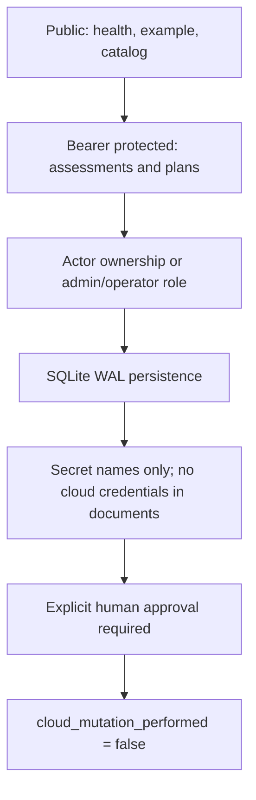

# Cloud Launchpad architecture

Cloud Launchpad is TITAN's front door for a developer who knows the application
shape but not the matching AWS, Azure, or Google Cloud services. The prototype accepts
one deliberately bounded workload—an OCI container serving HTTP, optionally using
PostgreSQL and object storage—and turns it into an explainable, persisted, guarded
deployment plan.

It is a planner, not a cloud account vending machine. This phase does not receive
credentials, apply infrastructure, promise free-tier eligibility, or invent a dollar
estimate. Those boundaries make it useful for learning without quietly creating cost.

## End-to-end flow

```mermaid
flowchart LR
    Developer["Developer describes application"] --> Portal["TITAN portal :3000"]
    Portal --> API["Launchpad API :8300"]
    API --> Validate["Strict workload validation"]
    Validate --> Catalog["Versioned source-linked service catalog"]
    Catalog --> Score["Deterministic weighted fit scoring"]
    Score --> Assessment["Persisted three-cloud assessment"]
    Assessment --> Gate{"Image digest, budget, data and scope gates pass?"}
    Gate -- "No" --> Blocked["BLOCKED with exact remediation"]
    Gate -- "Yes" --> Select["Human selects AWS, Azure or GCP"]
    Select --> Plan["Persisted dry-run deployment plan"]
    Plan --> Tofu["Credential-free OpenTofu architecture contract"]
    Tofu --> Review["Cost, identity, security and approval review"]
    Review -. "Later credentialed phase" .-> Apply["Provider plan and explicit apply"]
```



## Supported golden path

| Workload concern | Current support |
|---|---|
| Application | One public or private containerized HTTP service |
| Source | Clean HTTPS GitHub repository URL |
| Artifact | Public lowercase GHCR image pinned to a SHA-256 digest |
| Compute | App Runner, Container Apps, or Cloud Run recommendation |
| Database | None or managed PostgreSQL |
| Storage | Optional managed object storage |
| Geography | India, US, Europe, or a documented default for global |
| Identity | OIDC/workload identity design; no long-lived cloud keys |
| Cost | Cost shape and drivers plus official calculator link |
| State | SQLite with WAL, actor ownership, and idempotent writes |
| Deployment | Dry-run architecture only in this prototype |

Background workers, Kubernetes clusters, arbitrary repositories, private registry
authentication, restricted data, multi-region disaster recovery, and live provider
mutation are outside this first path. The API returns blockers instead of pretending
those cases are safe.

## Recommendation model

Each provider is scored from the same five criteria. The score is a deterministic fit
heuristic, not a benchmark and not a price quote.

| Criterion | Weight | Meaning |
|---|---:|---|
| Application fit | 30% | Match to the HTTP-container golden path |
| Operational simplicity | 25% | Managed runtime burden for a small team |
| Cost control | 20% | Scaling behavior and standing-cost pressure |
| Portability | 15% | OCI and provider-boundary characteristics |
| Data fit | 10% | Fit of optional PostgreSQL and object storage |

The input adjusts these values predictably. PostgreSQL and high availability increase
cost pressure; confidential data increases operational review; restricted data and a
background worker block readiness. Identical inputs produce identical rankings, apart
from generated IDs and timestamps.

## Provider mapping

| Capability | AWS | Azure | Google Cloud |
|---|---|---|---|
| HTTP container runtime | AWS App Runner | Azure Container Apps | Google Cloud Run |
| Registry | Amazon ECR | Azure Container Registry | Artifact Registry |
| PostgreSQL | Amazon RDS for PostgreSQL | Azure Database for PostgreSQL Flexible Server | Cloud SQL for PostgreSQL |
| Object storage | Amazon S3 | Azure Blob Storage | Cloud Storage |
| Secrets | AWS Secrets Manager | Azure Key Vault | Secret Manager |
| Deployment identity | GitHub OIDC + IAM | GitHub OIDC + federated identity | Workload Identity Federation |
| Observability | CloudWatch | Azure Monitor | Cloud Logging and Monitoring |

The versioned catalog in `src/titan_launchpad/catalog.py` stores a purpose, operating
model, cost drivers, official documentation link, and official pricing link for every
service. Current provider facts should be updated only from primary provider sources.

## Trust and safety boundaries



- Unknown request fields are rejected.
- Repository URLs cannot contain credentials, query strings, or fragments.
- Images must use an immutable GHCR digest before readiness.
- Every create call requires an idempotency key scoped by actor and operation.
- A reused key with different content returns a conflict.
- Non-admin identities can read and plan only their own assessments.
- Plan documents contain secret references, never secret values.
- Current free-tier eligibility is never guaranteed.
- `PROTOTYPE_DRY_RUN` is returned in the plan and planner output.

## Local operation

Start the full laptop stack:

```powershell
.\titan.ps1 local-up -Portal
```

Open `http://127.0.0.1:3000`, choose navigation item `05`, and connect the APIs with
the local token from the ignored `.env` file. Without a connection, the Launchpad UI
remains an honest non-persistent demo. With a connection, assessments and plans are
stored in the `launchpad-data` Docker volume.

The same engine is available without a browser:

```bash
PYTHONPATH=src python -m titan_launchpad example > workload.json
PYTHONPATH=src python -m titan_launchpad assess --file workload.json
PYTHONPATH=src python -m titan_launchpad plan --assessment ASSESSMENT_ID --provider gcp
```

Use `--database PATH` before the subcommand to select another local SQLite file.

## Credential-free infrastructure review

Each provider directory under `infrastructure/opentofu/launchpad` is a planner-only
module. It declares no cloud provider and no resources. Validation and plan therefore
need no cloud credentials and cannot create resources:

```bash
tofu -chdir=infrastructure/opentofu/launchpad/gcp init -backend=false
tofu -chdir=infrastructure/opentofu/launchpad/gcp validate
tofu -chdir=infrastructure/opentofu/launchpad/gcp plan -var-file=example.tfvars
```

Its output is an architecture contract with `cloud_mutation_performed = false`, the
selected services, the reviewed budget ceiling, and required approval gates.

## What remains before a real deployment

The later credentialed phase must be implemented and reviewed provider by provider:

1. Replace planner-only contracts with real, least-privilege provider modules.
2. Add GitHub Actions OIDC trust scoped to the exact repository, branch/environment,
   and protected production environment.
3. Mirror and verify the signed digest in the provider registry.
4. Calculate current cost in the provider calculator and configure budget alerts.
5. Run `tofu plan`, preserve the plan artifact, and require human approval.
6. Deploy only a disposable development workload, verify health/telemetry, and destroy
   it immediately after the learning test.
7. Add organization-specific networking, compliance, backup, RTO/RPO, incident, and
   access-review controls before calling the path production-ready.

No raw credential should be pasted into the portal, committed, stored in SQLite, or
sent in a chat. Prefer GitHub OIDC or an interactive short-lived provider login when
the live phase begins.

## Primary references

- [AWS App Runner documentation](https://docs.aws.amazon.com/apprunner/latest/dg/what-is-apprunner.html)
- [Azure Container Apps documentation](https://learn.microsoft.com/en-us/azure/container-apps/overview)
- [Google Cloud Run documentation](https://docs.cloud.google.com/run/docs/overview/what-is-cloud-run)
- [GitHub Actions OIDC reference](https://docs.github.com/en/actions/reference/security/oidc)

Every other service-specific source is returned directly by `GET /v1/catalog`.
